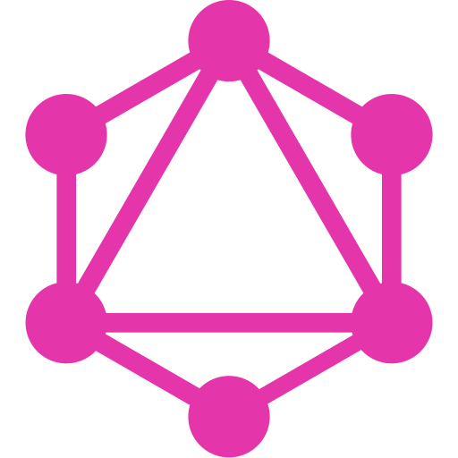

  

 

# Что будем делать (5 августа 2020)
1) Продолжим верстать "Super Host"

# Что сделали сегодня
1) Продолжили верстать "Super Host" (продолжили секцию 'intro')

# Ключевые моменты урока
Пока что чего-то важного не было. Единственное что хотел бы сказать это про "внимательность". Человек - не робот(компьютер), робот(компьютер) - не человек. И это очевидно. Мы люди устаем через определенное время работы и теряем внимательность. И это нормально, потому-что естественно. Поэтому когда мы что-то делаем, в частности пишем программу очень важно взять за привычку после каждого действия, шага проверять что мы делаем, пишем. Нет ни какой гарантиии что мы не сделаем ошибку, но можно гарантировать что если стараться контролировать каждый шаг, проверять его, то ошибок станет меньше.

 
 
 

  
  
  
  
  
  
  
  
  

